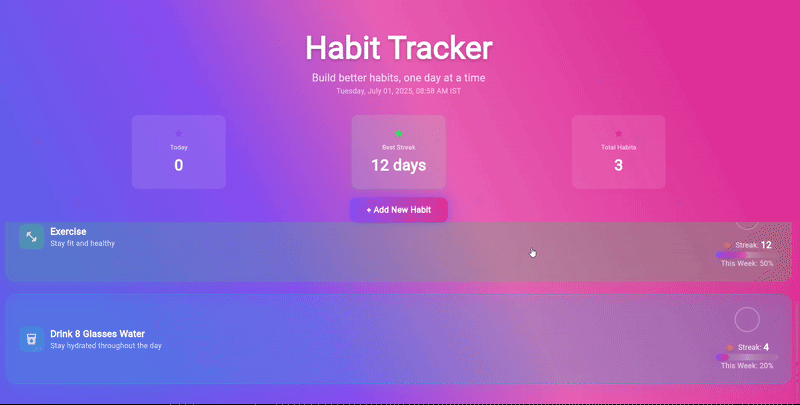
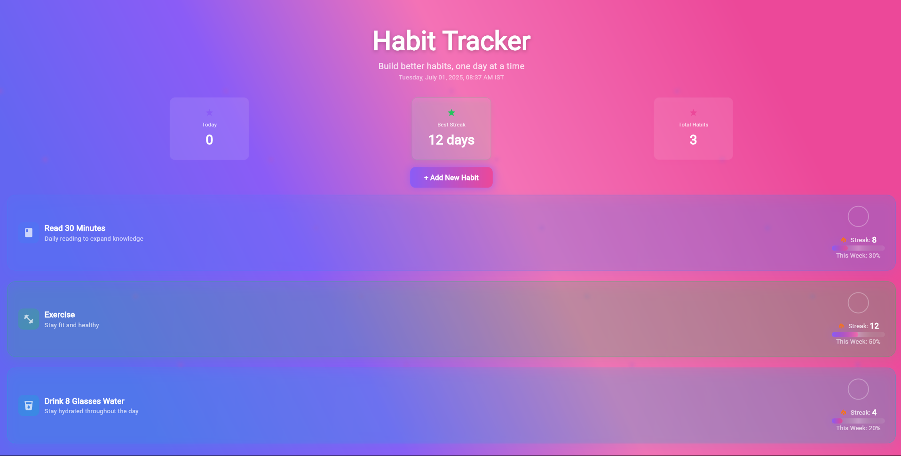
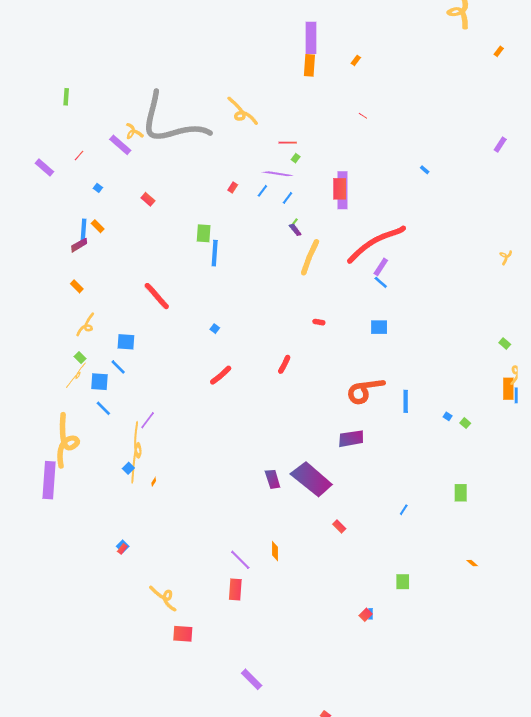
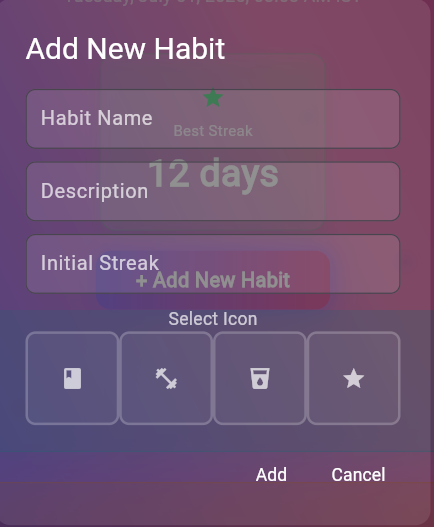

<h1 align="center">
  🚀 Flutter Habit Tracker App
</h1>

<p align="center">
  
  
  
</p>

<h3 align="center">
  🚀 Track Habits Like a Pro • 🎯 Build Momentum Daily • 🎉 Celebrate Your Wins!
</h3>

<p align="center">
  
</p>


## 🧠 About the App

> "Build better habits, one day at a time."

This beautifully animated **Flutter Habit Tracker** helps you:

- ✅ Create daily routines
- 🔁 Track progress with animated progress bars
- 💥 Celebrate streaks with confetti
- 🌈 Stay motivated with a particle-powered UI and custom colors

---

## ✨ UI Preview

<p align="center">
  
</p>

---

## 🎯 Key Features

| Feature                     | Description                                              |
|-----------------------------|----------------------------------------------------------|
| 🌀 Animated Background      | Custom `ParticlePainter` with gradient bubbles           |
| 🔧 Add Habits Dynamically   | Input modal with streaks, icon picker, and description   |
| 📊 Stats at a Glance        | Today’s streak, best streak, and total habit count       |
| 🎉 Confetti Celebration     | Triggered when habit progress reaches 100%               |
| ⚡ Interactive Cards         | Hover and click for habit-specific interactions          |
| 🌙 Beautiful Gradients      | Uses Tailwind-inspired gradient themes                   |

---

## 🧩 Tech Stack

| Tech                     | Use Case                            |
|--------------------------|-------------------------------------|
| `Flutter`                | Frontend framework                  |
| `Lottie`                 | Confetti animations                 |
| `CustomPainter`          | Particle background rendering       |
| `StatefulWidget`         | State management and updates        |
| `Icons & Gradients`      | Visual design                       |

---

## 🖼️ Screenshots

| Home Screen | Confetti Celebration | Add New Habit |
|-------------|----------------------|----------------|
|  |  |  |

---

## 🛠 How to Run

```bash
git clone https://github.com/Adarsh-Kumar6534/Habit-Tracker-Flutter.git
cd Habit-Tracker-Flutter
flutter pub get
flutter run
